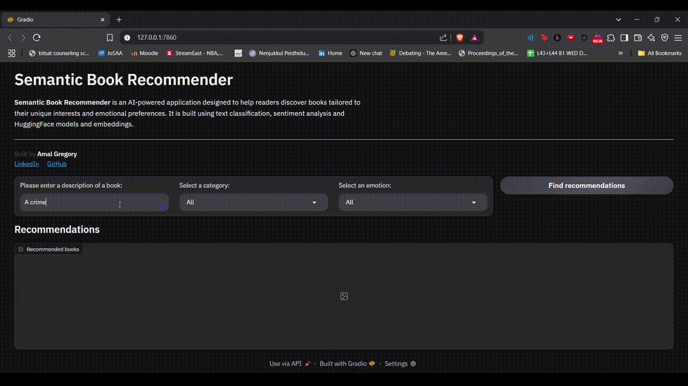

# Semantic Book Recommender

An AI-powered semantic book recommendation tool that suggests books based on a combination of natural language queries, broad category filters, and emotional tone preferences.

Built using sentence-transformer embeddings and vector similarity search, this project takes your description of the kind of story you're in the mood for and returns the most relevant book recommendations from a curated dataset of 7,000+ books.  

[7k Books Kaggle Database](https://www.kaggle.com/datasets/dylanjcastillo/7k-books-with-metadata)

 

---

## 🚀 Features
- Semantic Matching: Understands natural language inputs to find conceptually similar books.

- Category Filters: Filter results by general categories like Fiction, Non-fiction, Kids Fiction, etc.

- Emotion-based Sorting: Optionally prioritize results based on dominant emotional tones (e.g., Joy, Anger, Fear, Sadness, Surprise).

- Top-N Results: Returns the 16 most semantically relevant book matches.

- Visual Results: Covers and descriptions shown via an interactive Gradio interface.

---

## 🧠 Tech Stack
- Frontend/UI: Gradio (custom-themed Blocks layout for interactive book browsing).

- NLP Embeddings: Hugging Face Sentence Transformers.

- Vector Store: ChromaDB for fast semantic search over book embeddings.

- Data Preprocessing:
  - Custom tagging for emotions using metadata from the dataset.
  - Pre-extracted textual features from book descriptions.

- Utility Libraries:
  - langchain (for chaining data workflows and abstraction),
  - dotenv (for config),
  - pandas and numpy (for data handling)

